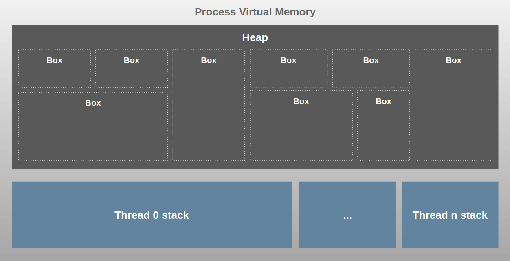
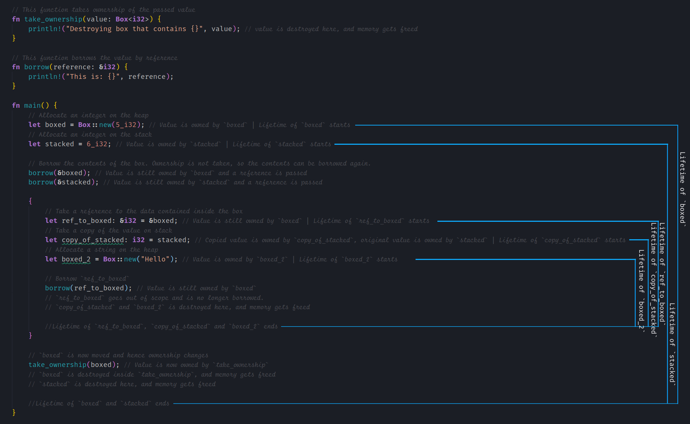

# Visualizing memory management in Rust

Rust is a **statically typed** & **compiled systems programming language** like C & C++. Rust is **memory & thread-safe** and does not have a **runtime or a garbage collector**.

## Rust internal memory structure

Rust doesn’t have a defined [memory model](https://doc.rust-lang.org/beta/reference/memory-model.html) in the language specifications as of now and the memory structure is quite straightforward.

Each Rust program process is allocated **some virtual memory** by the Operating System(OS), this is the total memory that the process has access to.


This is _quite simple_ compared to the memory structure we saw in the previous chapters for JVM, V8 and Go. As you can see there is _no generational memory_ or _any complex substructures since Garbage Collection(GC)_ is not involved.

**The reason for this is that Rust manages memory as part of program execution during runtime using the Ownership model rather than using any kind of GC**.

### Heap

This is where all **dynamic data**(_any data for which size cannot be calculated at compile time_) is stored. This is the biggest block of memory and the part managed by Rust’s Ownership model.

- Box: The [Box](https://doc.rust-lang.org/stable/rust-by-example/std/box.html) type is an abstraction for a heap-allocated value in Rust. Heap memory is allocated when `Box::new` is called. A `Box<T>` holds the **smart-pointer** to the heap memory allocated for type `T` and the reference is saved on the Stack.

### Stack

This is the Stack memory area and **there is one Stack per thread**. This is where static values are allocated by default. **Static data**(_data size known at compile time_) includes _function frames_, _primitive values_, _Structs and pointers_ to dynamic data in Heap.

## Rust memory usage (Stack vs Heap)

Let’s use the below Rust program, the code is not optimized for correctness hence ignore issues like unnecessary intermediatory variables and such, the focus is to visualize Stack and Heap memory usage.

```rs
struct Employee<'a> {
    // The 'a defines the lifetime of the struct. Here it means the reference of `name` field must outlive the `Employee`
    name: &'a str,
    salary: i32,
    sales: i32,
    bonus: i32,
}

const BONUS_PERCENTAGE: i32 = 10;

// salary is borrowed
fn get_bonus_percentage(salary: &i32) -> i32 {
    let percentage = (salary * BONUS_PERCENTAGE) / 100;
    return percentage;
}

// salary is borrowed while no_of_sales is copied
fn find_employee_bonus(salary: &i32, no_of_sales: i32) -> i32 {
    let bonus_percentage = get_bonus_percentage(salary);
    let bonus = bonus_percentage * no_of_sales;
    return bonus;
}

fn main() {
    // variable is declared as mutable
    let mut john = Employee {
        name: &format!("{}", "John"), // explicitly making the value dynamic
        salary: 5000,
        sales: 5,
        bonus: 0,
    };

    // salary is borrowed while sales is copied since i32 is a primitive
    john.bonus = find_employee_bonus(&john.salary, john.sales);
    println!("Bonus for {} is {}", john.name, john.bonus);
}
```

All values in Rust are allocated on the Stack by default. There are two exceptions to this:

1. When the size of the value is unknown, i.e Structs like String and Vectors which grows in size over time or any other dynamic value
2. When you manually create a `Box<T>` value like `Box::new("Hello")`. A box is a smart pointer to a heap-allocated value of type T. When a box goes out of scope, its destructor is called, the inner object is destroyed, and the memory on the Heap is freed.

In both exception cases, the value will be allocated on Heap and its pointer will live on the Stack.

[visualize](./Rust_memory_use.pdf)

As you can see:

- **Main** function is kept in a “main frame” on the Stack
- Every function call is added to the Stack memory as a **frame-block**
- All static variables including arguments and the return value is saved within the function frame-block on the Stack
- All static values regardless of type are stored directly on the Stack. This applies to global scope as well
- All dynamic types created on the Heap and is referenced from the Stack using **smart pointers**. This applies to the global scope as well. Here we explicitly made the name dynamic to avoid it going to the Stack as having a fixed-length string value will do that
- The struct with static data is kept on the Stack and any dynamic value in it is kept on the Heap and is referenced via pointers
- Functions called from the current function is pushed on top of the Stack
- When a function returns its frame is removed from the Stack
- Unlike Garbage collected languages, once the main process is complete, the objects on the Heap are destroyed as well, we will see more about this in the following sections

### Summary

- **The Stack as you can see is automatically managed and is done so by the operating system rather than Rust itself**.
- The Heap, on the other hand, is not automatically managed by the OS and since its the biggest memory space and holds dynamic data, it could grow exponentially causing our program to run out of memory over time. It also becomes fragmented over time slowing down applications.

This is where Rust’s ownership model steps in to automatically manage the Heap memory. [查看代码](https://gist.github.com/deepu105/3e49702d6ffac025eb8b8ca9539d7f67)

## Rust Memory management: Ownership

Rust has one of the most unique ways of managing Heap memory and that is what makes Rust special. It uses a concept called [ownership](https://doc.rust-lang.org/book/ch04-01-what-is-ownership.html) to manage memory. It is defined by a set of rules:

1. Every value in Rust must have a variable as its owner
2. There must be only one owner for a variable at any given time
3. When the owner goes out of scope the value will be dropped freeing the memory

The rules are applicable regardless of the value being in Stack or Heap memory. For example, in the below example the value of `foo` is dropped as soon as the method execution completes and the value of `bar` is dropped right after the block execution.

```rs
fn main() {
    let foo = "value"; // owner is foo and is valid within this method
    // bar is not valid here as its not declared yet

    {
        let bar = "bar value"; // owner is bar and is valid within this block scope
        println!("value of bar is {}", bar); // bar is valid here
        println!("value of foo is {}", foo); // foo is valid here
    }

    println!("value of foo is {}", foo); // foo is valid here
    println!("value of bar is {}", bar); // bar is not valid here as its out of scope
}
```

These rules are checked by the **compiler** at compile-time and _the freeing of memory happens at runtime along with program execution and hence there is no additional overhead or pause times here_. So by scoping variables carefully, we can make sure the memory usage is optimized and that is also why Rust lets you use block scope almost everywhere. This might sound simple but in practice, this concept has deep implications in how you write Rust programs and it takes some getting used to. **The Rust compiler does a great job of helping you along the way as well**.

Due to the strict ownership rules, Rust lets you change the ownership from one variable to another and is called a **move**. This is automatically done when passing a variable into a function or when creating a new assignment. _For static primitives, a **copy** is used instead of move_.

There are a few more concepts related to memory management that play along with Ownership to make it effective

### RAII

[RAII](https://en.wikipedia.org/wiki/Resource_acquisition_is_initialization) stands for **Resource acquisition is initialization**.

> This is not new in Rust, this is borrowed from C++.

Rust enforces RAII so that when a value is initialized the variable owns the resources associated and its destructor is called when the variable goes out of scope freeing the resources. **This ensures that we will never have to manually free memory or worry about memory leaks**.

```rs
fn create_box(i: u32) {
    // Allocate a string on the heap
    let _var_i = Box::new(format!("Hello {}", i));
    // `_var_i` is destroyed here, and memory gets freed
}
fn main() {
    // Allocate an integer on the heap
    let _var_1 = Box::new(5u32);
    // A nested scope:
    {
        // Allocate a string on the heap
        let _var_2 = Box::new("Hello 2");
        // `_var_2` is destroyed here, and memory gets freed
    }
    // Creating lots of boxes
    // There's no need to manually free memory!
    for i in 0u32..1_000 {
        create_box(i);
    }
    // `_var_1` is destroyed here, and memory gets freed
}
```

### Borrowing & Borrow checker

In Rust we can pass a variable by either value or by reference and passing a variable by reference is called **borrowing**. Since we can have only **one owner for a resource at a time**, we have to borrow a resource to use it without taking ownership of it. Rust compiler has a borrow checker that **statically ensures that references point to valid objects and ownership rules are not violated**.

```rs
// This function takes ownership of the passed value
fn take_ownership(value: Box<i32>) {
    println!("Destroying box that contains {}", value);
}
// This function borrows the value by reference
fn borrow(reference: &i32) {
    println!("This is: {}", reference);
}
fn main() {
    // Create a boxed and a stacked variable
    let boxed = Box::new(5_i32);
    let stacked = 6_i32;
    // Borrow the contents of the box. Ownership is not taken,
    // so the contents can be borrowed again.
    borrow(&boxed);
    borrow(&stacked);
    {
        // Take a reference to the data contained inside the box
        let _ref_to_boxed: &i32 = &boxed;
        // Error!
        // Can't destroy `boxed` while the inner value is borrowed later in scope.
        take_ownership(boxed);
        // Attempt to borrow `_ref_to_boxed` after inner value is destroyed
        borrow(_ref_to_boxed);
        // `_ref_to_boxed` goes out of scope and is no longer borrowed.
    }
    // `boxed` can now give up ownership to `take_ownership` method and be destroyed
    take_ownership(boxed);
}
```

### Variable Lifetimes

The **lifetime of variables** is another very important concept to _make the ownership model work_. It is a construct used by the borrow checker in order to ensure that all references to an object is valid.

- This is checked during compile time.
- The lifetime of a variable begins when its initialized and ends when it is destroyed.
- Lifetime is not the same as the scope.

This might sound straight forward **but lifetimes get much more complex** once functions and structs with references come into play and once they do then we would need to start **using [lifetime annotations](https://doc.rust-lang.org/stable/rust-by-example/scope/lifetime/explicit.html) to let the borrow checker know how long references are valid**. Sometimes the compiler can [infer lifetimes](https://doc.rust-lang.org/stable/rust-by-example/scope/lifetime/elision.html), but not always.

### Smart pointers

> Pointers are nothing but a reference to a memory address on the Heap. another concept taken from C++

Rust has support for pointers and lets us:

- reference: & operators
- dereference: \* operators

[Smart pointers](https://doc.rust-lang.org/book/ch15-00-smart-pointers.html?highlight=smart#smart-pointers) in Rust are like pointers but **with additional metadata capabilities**.

Unlike pointers which are references that only borrow data, smart pointers own the data they point to. `Box`, `String` and `Vec` are _examples of smart pointers in Rust_. You can also write your own smart pointers using structs.

## Ownership visualization
Now that we have seen different concepts used for Ownership, let us visualize it, unlike other languages where we visualized the data in Heap, here it is much easier if we look at the [code itself](https://gist.github.com/deepu105/681462673576bea16802c74252867323).



## Conclusion

This post should give you an overview of the Rust memory structure and memory management. This is not exhaustive, there are a **lot more advanced concepts** and the implementation details keep changing from version to version.

Unlike Garbage collected languages, where you need not understand the memory management model to use the language, in Rust, it is required to **understand how Ownership works** in order to write programs.